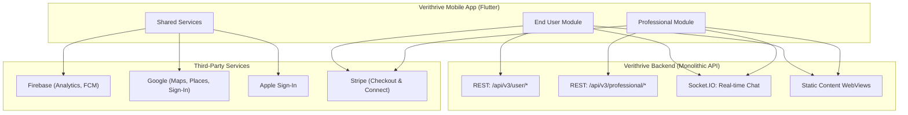
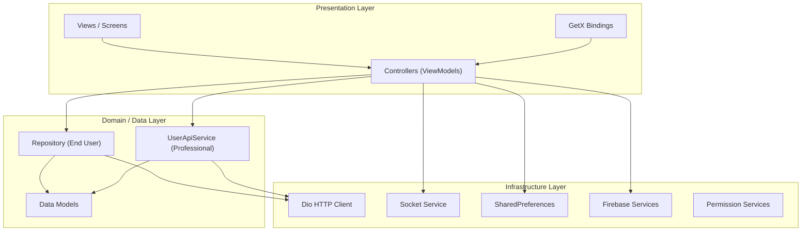
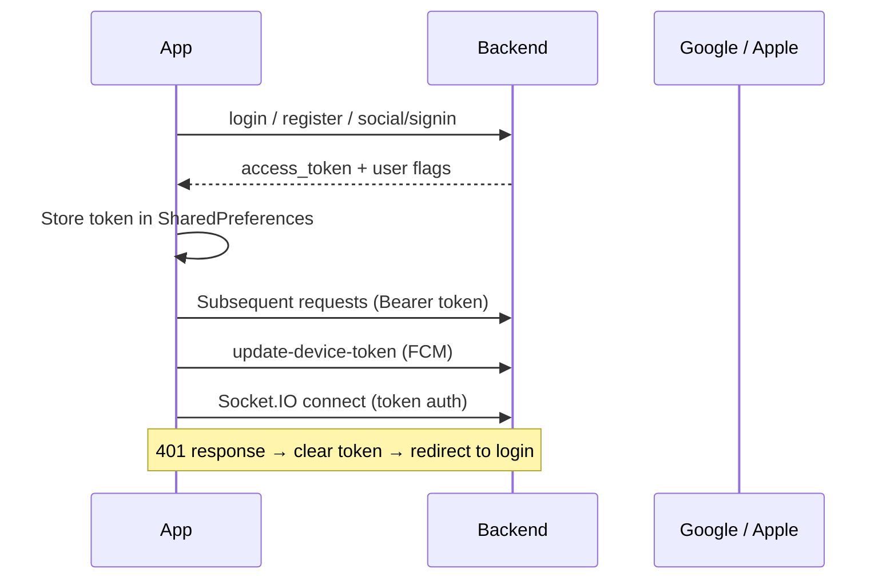
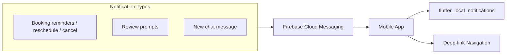

# Verithrive — Application Architecture

**Document version:** 1.0  
**Last updated:** 2026-07-16  
**App version:** 1.0.1+3

---

## 1. Purpose

Verithrive is a unified Flutter mobile application that connects **End Users** with wellness, fitness, and nutrition **Professionals**. A single binary serves both roles; the user selects their role at launch or is routed automatically based on stored session data.

This document describes the application architecture at a **conceptual level** — how the system is structured, how data flows, and how the major layers interact.

---

## 2. System Context



**Production host:** `https://adminportal.verithrive.co.uk`

From the mobile app's perspective, the backend is a **single monolithic API gateway**. There are no client-side references to microservices; all REST and Socket.IO traffic goes to one host with versioned paths for each user role.

---

## 3. Architectural Principles

| Principle | Description |
|-----------|-------------|
| **Single codebase, dual domain** | End-user and professional features live in separate module trees but share services, theme, and entry point. |
| **Client–server separation** | Business logic, payments, and booking rules are enforced on the backend; the app is a presentation and orchestration layer. |
| **Reactive UI** | GetX controllers expose observable state; views rebuild via `Obx` when state changes. |
| **Server-mediated payments** | Stripe Checkout URLs are returned by the backend and opened in a WebView — no Stripe SDK in the mobile app. |
| **Real-time over REST for chat** | Chat inbox and history use REST; live message delivery uses Socket.IO. |

---

## 4. Layered Architecture



### 4.1 Presentation Layer

Follows an **MVVM-like pattern** using GetX:

| Component | Responsibility | Location |
|-----------|----------------|----------|
| **View** | UI widgets, layout, user input | `lib/enduser/screens/`, `lib/professional/` |
| **Controller** | State, business orchestration, API calls | `*Controller.dart` alongside views |
| **Binding** | Dependency injection for a screen | `*Binding.dart` alongside views |

Navigation uses **GetX routing** at the root level (`lib/routes/`) for professional flows and splash/role selection. End-user flows primarily use imperative navigation (`Get.to()`, `Get.offAll()`) with named routes defined in `lib/enduser/routes/`.

### 4.2 Domain / Data Layer

| Role | Pattern | Key files |
|------|---------|-----------|
| **End User** | Repository → Remote Data Source | `lib/enduser/data/` |
| **Professional** | Typed API service methods | `lib/api/user_api_service.dart` |
| **Shared** | Cross-role models | `lib/models/` |

Both roles use **Dio** for HTTP. End-user requests include device metadata headers (timezone, device token, OS version, app version). Professional requests use a centralized `DioClient` with a 401 interceptor that clears the session and redirects to login.

### 4.3 Infrastructure Layer

Shared services in `lib/services/`:

| Service | Purpose |
|---------|---------|
| `StorageService` | Token and session persistence (SharedPreferences) |
| `SocketService` | Socket.IO connection for professional chat |
| `AnalyticsService` | Firebase Analytics event tracking |
| `FirebaseTokenService` | FCM token retrieval and sync |
| `ForegroundNotificationService` | Local notifications and FCM foreground handling |
| `SocialAuthService` | Google and Apple OAuth, token exchange with backend |
| `NotificationService` | Notification permission and display |
| `ConnectivityService` | Network status monitoring |

End-user chat has a parallel socket implementation at `lib/enduser/screens/message/socket_service.dart`.

---

## 5. Module Structure

```
lib/
├── main.dart                  # App entry — Firebase, notifications, GetMaterialApp
├── api/                       # Professional API client (DioClient, UserApiService)
├── common/                    # Firebase config, shared utilities
├── core/                      # Shared UI components
├── enduser/                   # End-user module
│   ├── screens/               # Feature screens (home, booking, chat, payment, …)
│   ├── data/                  # Repository + remote data source
│   ├── routes/                # End-user named routes
│   ├── bindings/              # Root DI bindings
│   └── flavors/               # Environment scaffolding (partially used)
├── professional/              # Professional module
│   ├── splash/                # Unified splash + session routing
│   ├── onboarding/            # Registration wizard
│   ├── home/                  # Dashboard, calendar, messages, profile tabs
│   ├── subscription/          # Subscription plans and purchase
│   └── …                      # Profile wizard steps, availability, services
├── select_user/               # Role selection (End User vs Professional)
├── routes/                    # Root GetX routes (splash, professional flows)
├── services/                  # Cross-cutting services
├── models/                    # Shared data models
├── theme/                     # Colors, typography (Poppins, Rubik)
└── widgets/                   # Reusable widgets
```

---

## 6. User Roles

The app supports two distinct user personas within one binary:

### 6.1 End User

- Browse professionals by category (Wellness, Fitness, Food & Nutrition)
- Search, filter, and save professionals
- Book consultations (date, time, service format)
- Pay via Stripe Checkout
- Chat with professionals in real time
- Manage profile, saved cards, and booking history
- Optional guest browsing mode

**Main navigation (5 tabs):** Home → Bookings → Messages → Saved → Profile

### 6.2 Professional

- Multi-step onboarding and profile wizard
- Define services, qualifications, availability, and service formats
- Purchase platform subscription (Stripe Checkout)
- Complete Stripe Connect onboarding for payouts
- Manage bookings via dashboard and calendar
- Chat with clients in real time

**Main navigation (4 tabs):** Dashboard → Calendar → Messages → Profile

---

## 7. Authentication & Session Model



**Session storage:** SharedPreferences (`access_token`, `userType`, onboarding wizard flags).

**Social auth flow:** OAuth token obtained from Google/Apple SDK → sent to backend `social/signin` → backend returns app session token.

**Role routing at splash:** Token present → check `userType` and wizard completion flags → route to appropriate module and onboarding step.

---

## 8. Real-Time Communication

Chat uses a **hybrid REST + Socket.IO** model:

| Operation | Transport |
|-----------|-----------|
| Fetch inbox | REST `POST chat/inbox` or Socket `get_inbox` |
| Create/get room | REST `POST chat/room` |
| Load message history | REST `GET chat/messages/{room_id}` |
| Send/receive live messages | Socket `send_message` / `receive_message` |
| Mark as read | Socket `mark_read` |
| Online status | Socket `user_connection_status` |

Socket connection: `wss://adminportal.verithrive.co.uk/socket.io` with Bearer token authentication.

---

## 9. Payment Architecture

Payments are **fully server-orchestrated**:

1. App calls backend endpoint (e.g. `create-booking`, `subscriptions/buy`)
2. Backend returns a `checkout_url` (Stripe Checkout session)
3. App opens URL in `webview_flutter`
4. On completion, app refreshes booking/subscription state from backend

Professionals additionally complete **Stripe Connect** onboarding via a backend-provided WebView URL for receiving payouts.

No payment card data is handled directly by the mobile app beyond saved-card token references returned by the backend.

---

## 10. Push Notifications



FCM tokens are synced to the backend via `update-device-token` on login and token refresh. Foreground messages are displayed as local notifications via `ForegroundNotificationService`.

---

## 11. Environment & Configuration

| Aspect | Current state |
|--------|---------------|
| **Environments** | Production (`adminportal.verithrive.co.uk`), Dev and Local URLs commented in code |
| **Flavor scaffolding** | `lib/enduser/flavors/` exists but `baseUrl` is empty in `main.dart`; URLs are hardcoded in API service files |
| **Secrets** | Firebase config in Dart; Google Maps keys in AndroidManifest / Info.plist; `google-services.json` and `GoogleService-Info.plist` not in version control |
| **CI/CD** | Not configured in repository |

---

## 12. Key Design Decisions & Trade-offs

| Decision | Rationale | Trade-off |
|----------|-----------|-----------|
| Unified app vs. two apps | Single codebase, shared services, one store listing per role selection | Larger codebase; navigation complexity between modules |
| GetX for everything | Fast development, built-in DI and routing | Less separation than strict Clean Architecture |
| Dual API clients | Professional uses typed service; end-user uses repository pattern from legacy codebase | Inconsistent patterns between modules |
| WebView for Stripe | Simpler PCI scope; backend controls payment flow | Less native payment UX |
| SharedPreferences for tokens | Simple, no extra dependency | Not as secure as encrypted/secure storage |
| Socket.IO for chat only | Sufficient for messaging use case | No in-app video/voice consultation (no WebRTC) |

---

## 13. Related Documents

- [Technology Stack & APIs](./TECHNOLOGY_STACK_AND_APIS.md)
- [User & System Flows](./USER_AND_SYSTEM_FLOWS.md)
- [Project Setup & Build Guide](PROJECT_DOCUMENTATION.md)
