# Verithrive — User & System Flows

**Document version:** 1.0  
**Last updated:** 2026-07-16  
**App version:** 1.0.1+3

---

## 1. Overview

This document describes the high-level **user journeys** and **system flows** for the Verithrive mobile application, aligned with the agreed product prototype. Flows are organised by user role and cover the primary paths from app launch through core features.

---

## 2. System Boot Flow

Every app launch follows this sequence:

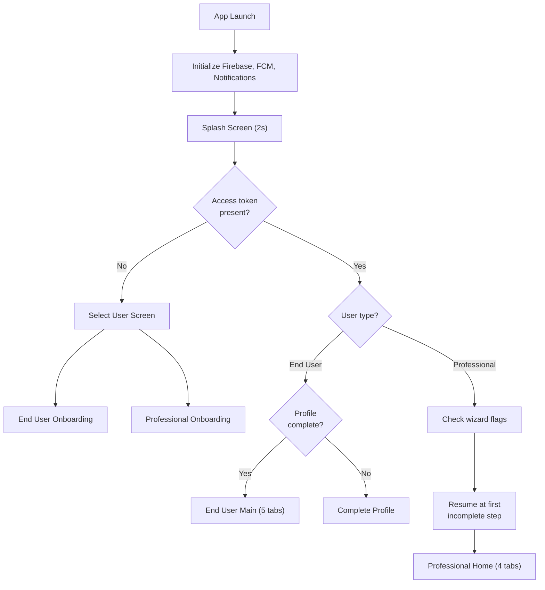

**Key behaviour:**
- No token → user chooses End User or Professional
- Token + end user → `MainScreen` if profile complete, else profile completion
- Token + professional → resume onboarding wizard at the first incomplete step based on stored flags

---

## 3. End User Flows

### 3.1 Onboarding & Authentication

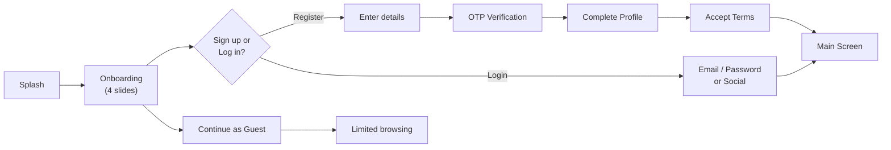

| Step | Screen / Route | Description |
|------|----------------|-------------|
| Onboarding | `/onboarding` | 4-slide introduction carousel |
| Register | `/register` | Name, email, phone, password |
| OTP | `/otp` | Email/phone OTP verification |
| Profile | `/profile` | Personal details (name, DOB, gender, photo) |
| Terms | `/terms_conditions` | Accept terms and privacy policy |
| Main | `/main` | 5-tab home screen |

**Alternative paths:**
- **Social login:** Google or Apple → backend `social/signin` → profile/terms if first login
- **Forgot password:** `/forgot_password` → OTP → `/create_password`
- **Guest mode:** Browse professionals with limited API access (no booking/payment)

---

### 3.2 Discovery & Search

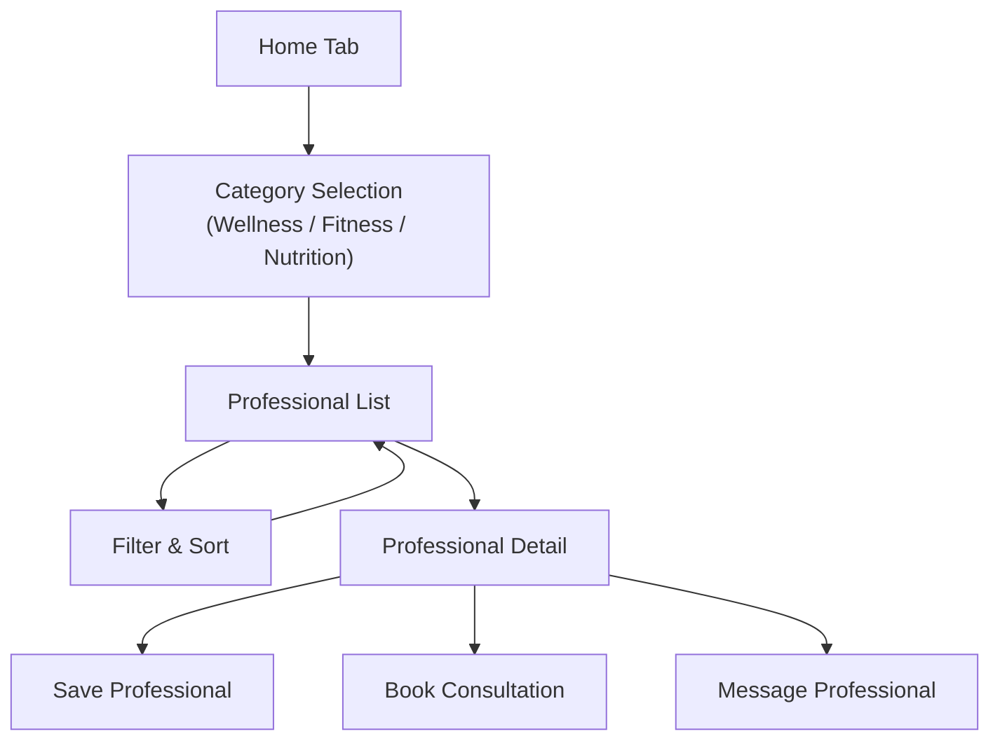

| Feature | Route / Screen | Description |
|---------|----------------|-------------|
| Home categories | Home Tab | Wellness, Fitness, Food & Nutrition tiles |
| Professional list | `/therapy_list` | Paginated list with search |
| Filters | `/therapy_filter`, `/professional_filter`, `/price_filter`, `/availability_filter`, `/distance_filter`, `/gender_filter` | Multi-criteria filtering |
| Sort | `/sort` | Sort by relevance, price, distance, rating |
| Professional detail | `/therapy_detail` | Bio, services, reviews, availability preview |
| Saved | Saved Tab | Bookmarked professionals |

**Fitness-specific goal flows (prototype):**
- `/fitness_goal` → set fitness goals
- `/trainer_preference` → trainer preferences
- `/nutrition_goal` → nutrition goals

---

### 3.3 Booking & Payment

This is the core end-user transaction flow:

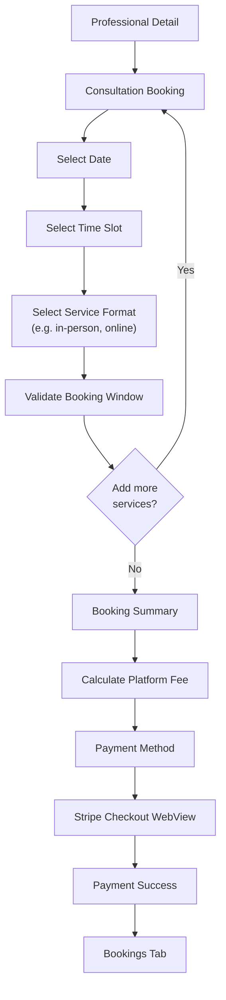

| Step | Route | API |
|------|-------|-----|
| Select date/time/format | `/consultation_booking` | `professionals/service-format-availability/details` |
| Validate | — | `validate-booking-window` |
| Cart (optional) | `/cart` | `update-booking` |
| Summary | `/summary` | `professional/platform-fee` |
| Payment | `/payment` | `create-booking` → returns `checkout_url` |
| Stripe Checkout | WebView | External Stripe session |
| Success | `/payment_success` | — |
| View booking | Bookings Tab | `bookings/list` |

**Saved cards:** Users can manage cards via `add-cards`, `get-cards-details`, `edit-card/{id}`, `delete-card/{id}`.

---

### 3.4 Consultation Lifecycle

After booking, the consultation progresses through notification-driven states:

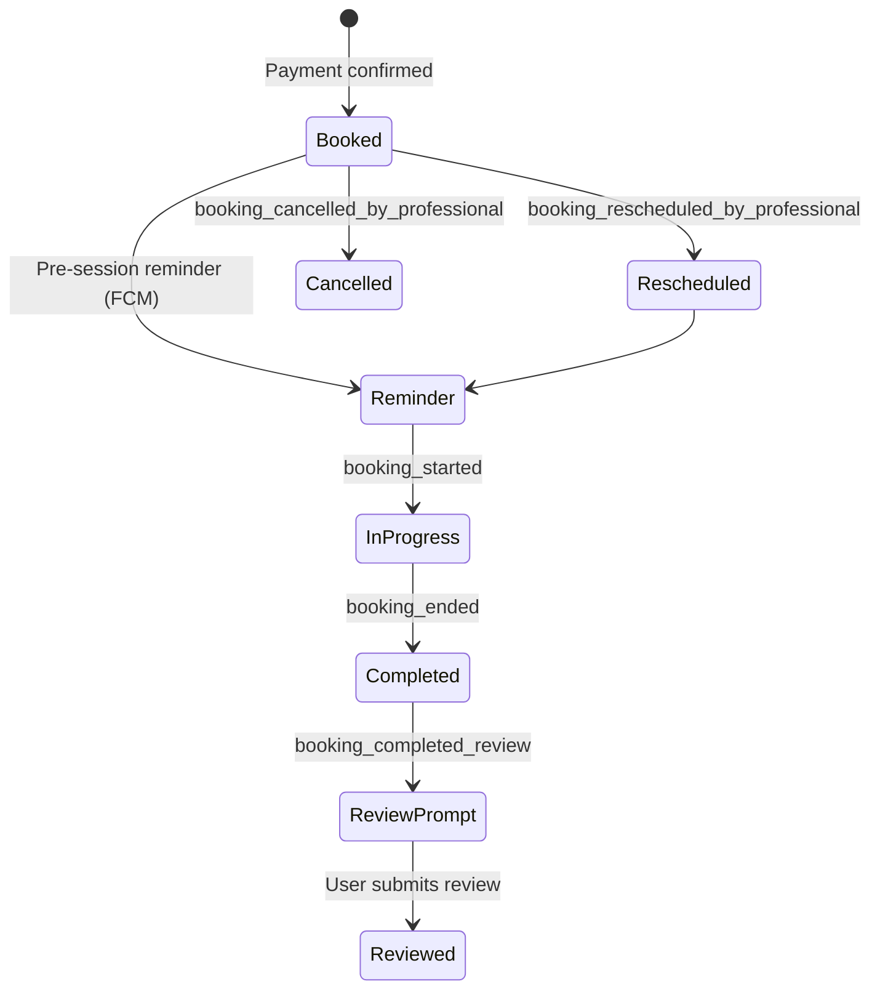

| Notification type | User action |
|-------------------|-------------|
| `booking_*_reminder` | View booking in Bookings tab |
| `booking_rescheduled_by_professional` | View updated booking details |
| `booking_cancelled_by_professional` | View cancellation; option to rebook |
| `booking_completed_review` | Navigate to review screen (`professionals/rate-review`) |
| `review_reminder` / `final_review_reminder` | Prompt to leave review |

**Bookings tab:** Lists upcoming and past bookings with status, professional info, and actions (view detail, message, review).

---

### 3.5 Messaging

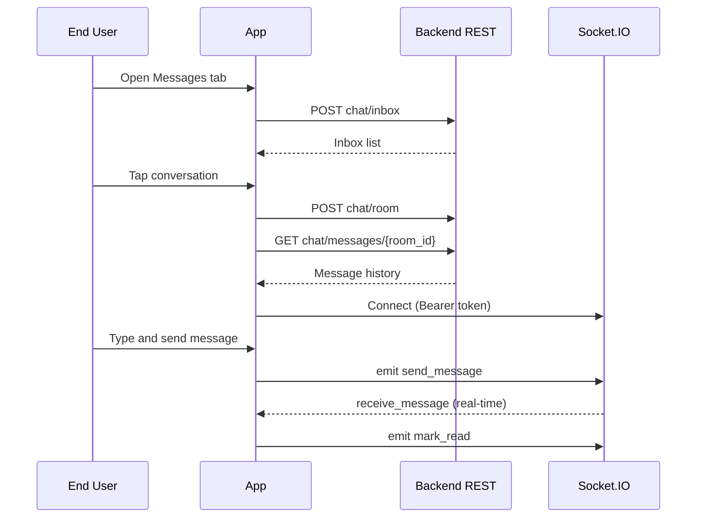

| Screen | Route | Description |
|--------|-------|-------------|
| Messages tab | Main Tab 2 | Inbox with unread badges |
| Chat detail | `/chat_detail` | Conversation view with real-time updates |
| Notifications | `/notification` | Push notification history |

---

### 3.6 Profile & Account Management

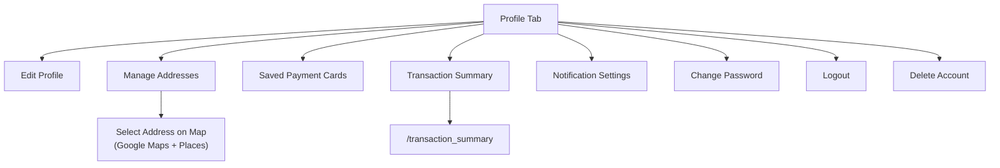

---

### 3.7 End User Tab Navigation

| Tab index | Tab | Primary content |
|-----------|-----|-----------------|
| 0 | Home | Categories, search, featured professionals |
| 1 | Bookings | Upcoming and past consultations |
| 2 | Messages | Chat inbox |
| 3 | Saved | Saved professionals |
| 4 | Profile | Account settings and preferences |

---

## 4. Professional Flows

### 4.1 Registration & Onboarding Wizard

The professional onboarding is a **flag-driven multi-step wizard**. The app resumes at the first incomplete step on every launch.

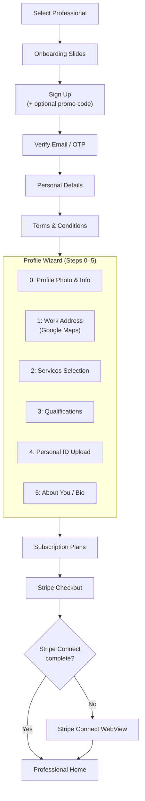

**Wizard completion flags** (stored in SharedPreferences):

| Flag | Step |
|------|------|
| `is_personal_details` | Personal details |
| `is_term_condition` | Terms acceptance |
| `is_profile_created` | Profile photo and info |
| `is_work_full` | Work address |
| `is_professional_services` | Services |
| `is_qualification` | Qualifications |
| `is_personal_identification` | ID documents |
| `is_about_you` | Bio |
| `is_payment` | Subscription purchased |

---

### 4.2 Subscription & Stripe Connect

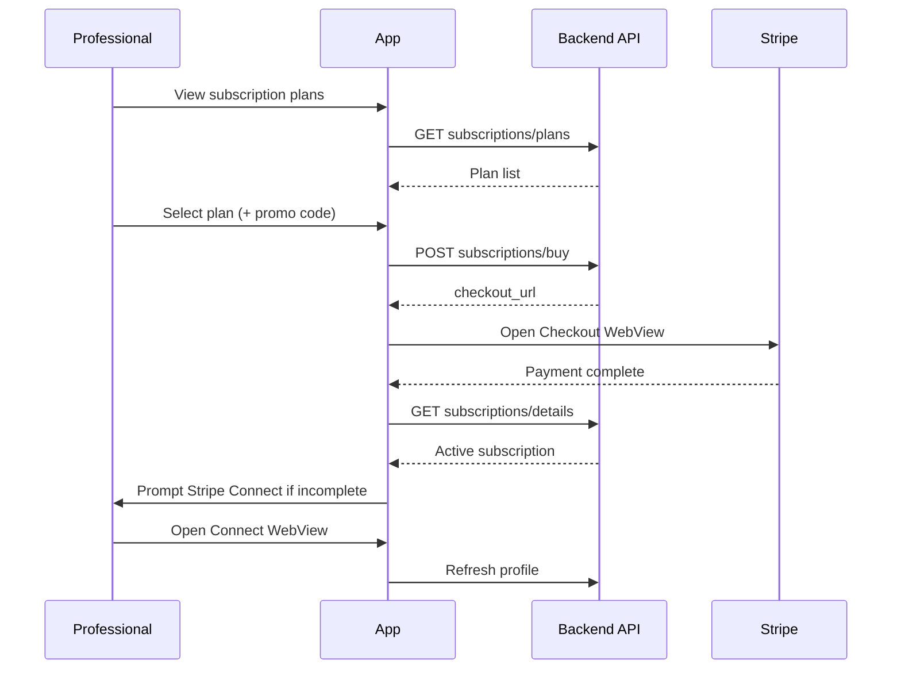

| Step | API | Description |
|------|-----|-------------|
| View plans | `subscriptions/plans` | Available tiers |
| Apply promo | `check-promo-code` | Discount validation |
| Purchase | `subscriptions/buy` | Returns Stripe Checkout URL |
| View status | `subscriptions/details` | Current plan and expiry |
| Cancel | `subscriptions/cancel` | Cancel subscription |
| Connect onboarding | WebView URL from profile | Stripe Connect for payouts |

---

### 4.3 Service Formats & Availability

After onboarding, professionals configure how they deliver services:

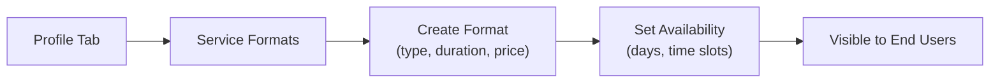

| Action | API |
|--------|-----|
| List formats | `service-formats/all` |
| Create format | `POST service-formats` |
| Update/delete format | `PUT/DELETE service-formats/{id}` |
| Set availability | `POST availability` |
| View availability | `GET get-service-format-availability` |

---

### 4.4 Booking Management

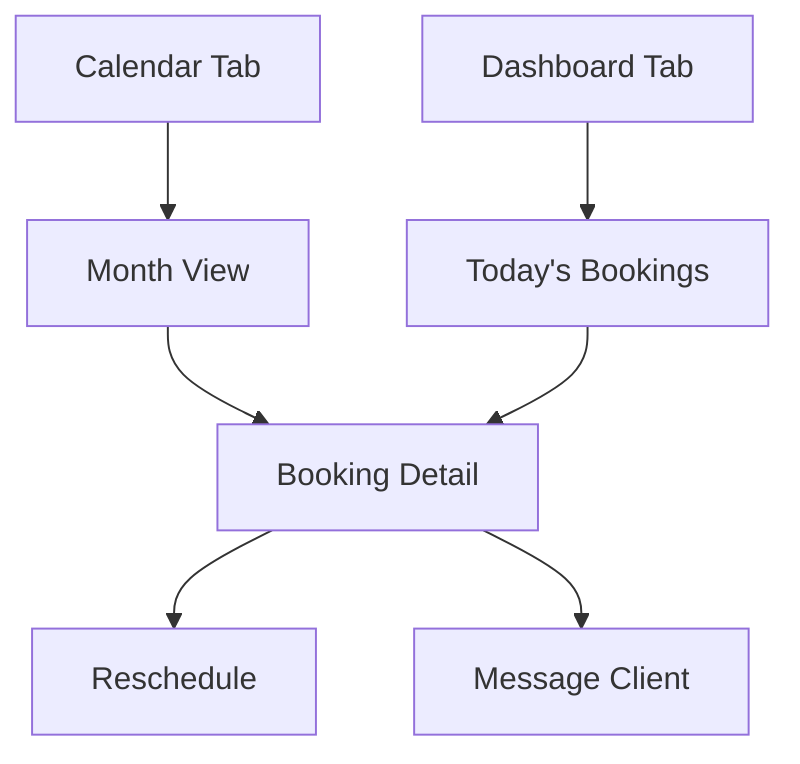

| Screen | Description | API |
|--------|-------------|-----|
| Dashboard | Today's appointments, quick stats | `bookings/list` (filtered) |
| Calendar | Monthly calendar with booking markers | `bookings/list` |
| Booking detail | Client info, service, time, status | `bookings/{id}` |
| Reschedule | Change date/time | `bookings/reschedule/{id}` |

---

### 4.5 Professional Messaging

Same hybrid REST + Socket.IO model as end users:

| Screen | Description |
|--------|-------------|
| Messages tab | Client inbox with unread counts |
| Chat detail | Real-time conversation with client |

Socket events: `get_inbox`, `send_message`, `receive_message`, `mark_read`, `user_connection_status`.

---

### 4.6 Profile & Account (Professional)

| Section | Description | API |
|---------|-------------|-----|
| Personal details | Name, contact, photo | `update-personal-details` |
| Work address | Service location on map | `create-address` |
| Services | Selected service offerings | `profession-services` |
| Qualifications | Degrees, certifications | `qualifications/upsert` |
| Bank details | Payout account | `bank-details` |
| Subscription | Plan management | `subscriptions/*` |
| Notifications | Preference settings | `notification` |
| Transaction history | Earnings and payments | `transaction-history` |

---

### 4.7 Professional Tab Navigation

| Tab index | Tab | Primary content |
|-----------|-----|-----------------|
| 0 | Dashboard | Today's bookings, overview |
| 1 | Calendar | Monthly booking calendar |
| 2 | Messages | Client chat inbox |
| 3 | Profile | Profile wizard sections, settings, subscription |

---

## 5. Cross-Cutting System Flows

### 5.1 Push Notification Routing

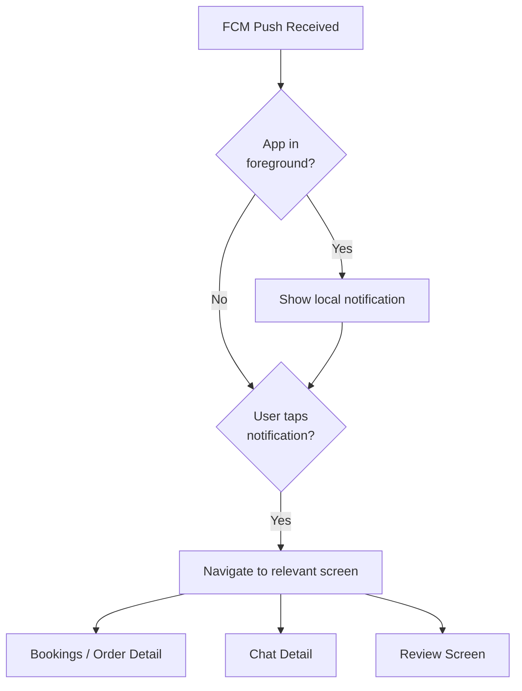

Notification tap routing uses payload `type` to determine destination (booking detail, chat, review prompt).

---

### 5.2 Session Expiry

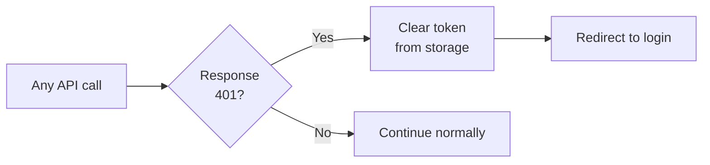

Handled by Dio 401 interceptor in `lib/api/dio_client.dart`.

---

### 5.3 Address Selection (Both Roles)

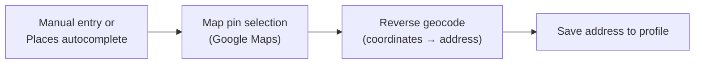

Uses Google Places API for autocomplete, Google Maps for pin placement, and Geocoding for address resolution.

---

## 6. Prototype Alignment Summary

The following prototype features are implemented in the current codebase:

| Prototype feature | Status | Primary flow section |
|-------------------|--------|----------------------|
| Dual role app (End User / Professional) | Implemented | §2 System Boot |
| Onboarding carousels | Implemented | §3.1, §4.1 |
| Email + OTP registration | Implemented | §3.1, §4.1 |
| Social login (Google, Apple) | Implemented | §3.1, §4.1 |
| Guest browsing | Implemented | §3.1 |
| Category-based discovery | Implemented | §3.2 |
| Advanced search & filters | Implemented | §3.2 |
| Professional detail & reviews | Implemented | §3.2 |
| Consultation booking (date/time/format) | Implemented | §3.3 |
| Cart and booking summary | Implemented | §3.3 |
| Stripe payment (Checkout WebView) | Implemented | §3.3 |
| Booking lifecycle notifications | Implemented | §3.4 |
| Real-time chat | Implemented | §3.5, §4.5 |
| Saved professionals | Implemented | §3.2 |
| Profile & address management | Implemented | §3.6 |
| Fitness/nutrition goal setting | Implemented | §3.2 |
| Professional profile wizard (6 steps) | Implemented | §4.1 |
| Subscription plans & promo codes | Implemented | §4.2 |
| Stripe Connect for payouts | Implemented | §4.2 |
| Service formats & availability | Implemented | §4.3 |
| Booking calendar & reschedule | Implemented | §4.4 |
| Push notifications with deep links | Implemented | §5.1 |
| Transaction history | Implemented | §3.6, §4.6 |

**Not in current scope (not found in codebase):**
- In-app video/voice consultation (no WebRTC/Agora)
- Alternative payment gateways (Razorpay, PayPal SDK)

---

## 7. Related Documents

- [Application Architecture](./ARCHITECTURE.md)
- [Technology Stack & APIs](./TECHNOLOGY_STACK_AND_APIS.md)
- [Project Setup & Build Guide](PROJECT_DOCUMENTATION.md)
